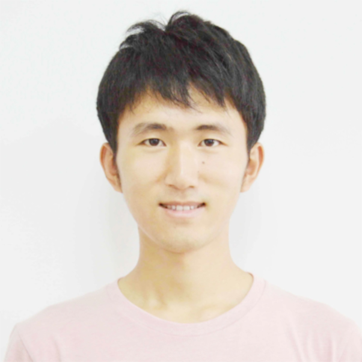

## Cheng Ding

---

---

### Internship

##### `Splunk` (Software Engineer Intern, Jul '16 -- Present)

- Splunk is an American multinational corporation based in San Francisco, California.
- Build an app which monitors status and analyzes behaviors of multiple Splunk clusters in real time.
- Related Technologies: Splunk knowledge, Python, RESTful, Distributed System.

##### `Infosys` (Software Engineer Intern, Oct '15 -- Dec '15)

- Construct a professional network from employee profile data and project assignment data;
- Research team formation problem for projects given project requirements; 
- Develop a system Talent Network for search, recommendation and team formation; 
- Related Technologies: Java, Neo4j, Lucene, RESTful Service, R & igraph, Hadoop & MapReduce, Zookeeper.

---

### Projects

##### Enterprise Knowledge Base Construction (Mar '15 -- May '15)

- Crawl and integrate GB level news data from multiple sources;
- Extract company names and relationships from news data and build timeline for many big companies;	
- Technologies: Java, NLP, Lucene, MySQL.

##### Social Meida Data Management (Dec '14 -- Jan '15)

- Develop distributed crawler to crawl TB level microblog data from weibo.com;
- Using big data platform to process and manage the massive data;
- Technologies: Java, multi-theads, Weibo APIs, Hadoop & MapReduce, ZooKeeper, Kafka, NLP

---

### Education

##### `East China Normal University` 

Master, Software Engineering, 2014-2017

##### `Dalian Maritime University`

Bachelor, Software Engineering (GPA: 3.62/4.0), 2010-2014

---

### Skills

##### Technical specialties

Solid knowledge of technologies: Data Structure & Algorithms, Java, Hadoop and MapReduce
Good knowledge of: Git, Linux, Python, C, Lucene, Kafka, Zookeeper, Airflow and so on.

##### Language proficiency

Mandarin (mother tongue), English (fluent, CET-6) and Japanese (intermediate, N2)

---

### Awards

1. Rank 2 of TouchPal Hackathon 2016 2016
2. Rank 36 of Microsoft Beauty of Programming Contest 2016
3. Scholarship for Outstanding Students (Top 5 % students) 2011-2014
4. Rank 21 of 2013 ACM/ICPC Sino-Russia University Competition 2013

---

### Interests

cooking, open source, photography, problem sloving, software engineering, sports, travel, volunteering.

---

### Social Activities

1. Wildlife conservation propaganda, 2015, Bangalore, India
2. CIEE Chinese tutor for international students, 2014, Shanghai, China
3. Volunteer of VLDB 2014 Summer School, 2014, Shanghai, China
4. Attend talk at Cookpad Inc. HQ, 2013, Tokyo, Japan		
					
